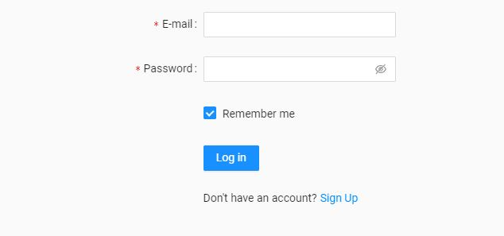
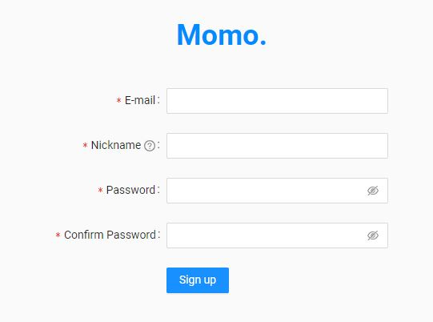
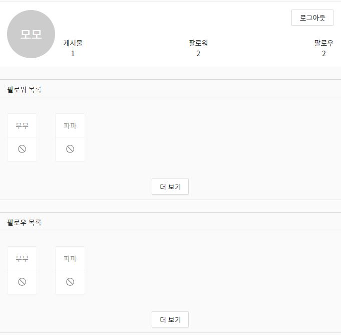
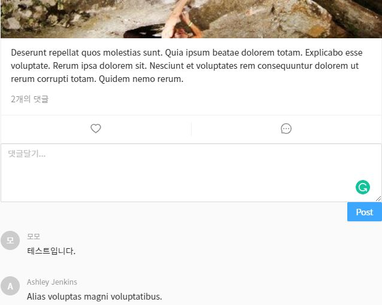
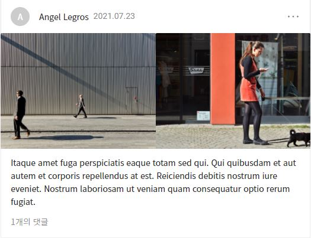
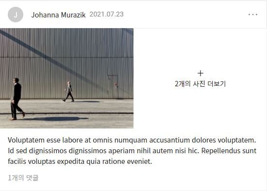
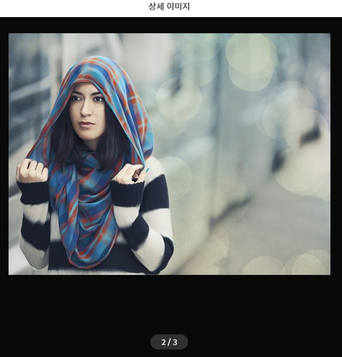
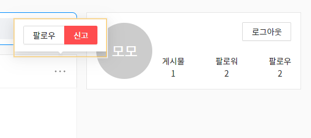
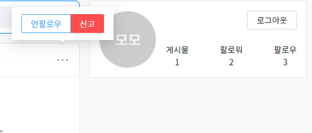

# Momo SNS Project

## Intro

제로초 강의 복습 && 응용

더미데이터와 함께 프론트 SNS화면 구현하기

## Tech

- Next JS
- React Hooks
- Redux
- Redux-Saga
- Intersection-Observer
- Immer
- Faker
- Emootion
- Ant Design

 

## List

- [x] LoginForm

 

- [x] Signup Page

 

- [x] Profile Page

 

- [x] Post

 

- [x] Comment

 

- [x] Image

 

- [x] Image Carousel

 

- [x] Follow, Unfollow

 

- [x] HashTag Link

 

- [x] Infinite Scrolling
